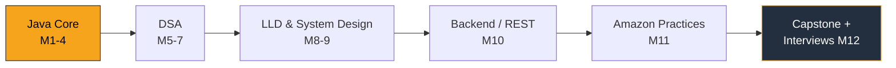

<!-- Animated typing header (animated SVG served as an image) -->
<p align="center">
  <a href="https://github.com/rubeshsv/java-developer-bible">
    
  </a>
</p>

<!-- Badges (shields.io) -->
<p align="center">
  
  
  
  
  
</p>

---

My journey from **QA Engineer → Amazon-level Software Development Engineer**.
Started **2026-08-01** · Pace **~10 hrs/week** · Tracking every step here.

## 📊 Progress

`Fundamentals` ▓▓▓▓▓▓▓▓▓▓▓░░░░ **Day 8** · `Java Core` in progress

| Phase | Months | Status |
|-------|--------|--------|
| Java Fundamentals | 1–4 | 🟢 In progress (Day 8) |
| Data Structures & Algorithms | 5–7 | ⚪ Upcoming |
| LLD & System Design | 8–9 | ⚪ Upcoming |
| Backend / REST (Spring Boot) | 10 | ⚪ Upcoming |
| Amazon Practices (Coral/CRUX) | 11 | ⚪ Upcoming |
| Capstone + Interview Prep | 12 | ⚪ Upcoming |

## 🗺️ Roadmap


## 🧰 Tech
`Java 21` · `Maven` · `IntelliJ IDEA` · `Git` · `GitHub`
*Target stack:* Coral · Brazil · CRUX · AWS SDK (S3)

## 📂 Structure
```
src/main/java/com/rubeshsv/bible/
├── day01/  HelloWorld
├── day02/  IntegerFamily · TypesAndCasting · ScannerBasics · UnitConverter
├── day03/  ControlFlowBasics · SwitchBasics
├── day04/  LoopBasics · LoopProject · FizzBuzz
├── day05/  MethodBasics · CalculatorMethods
├── day06/  ArrayBasics
├── day07/  ArrayAlgorithms · ArrayStats
└── day08/  StringBasics            (week2/day1 · Strings — in progress)
```

## 📅 Progress Log

| Day | Date       | Topics                                                          | Status |
|-----|------------|-----------------------------------------------------------------|--------|
| 1   | 2026-08-01 | Setup, JVM/compile flow, program anatomy, Git/GitHub            | ✅ |
| 2   | 2026-08-02 | Variables, data types, casting, overflow, memory, Scanner       | ✅ |
| 3   | 2026-08-03 | Operators, if/else, ternary, switch                             | ✅ |
| 4   | 2026-08-04 | Loops (for/while/do-while), break/continue, FizzBuzz            | ✅ |
| 5   | 2026-08-05 | Methods, overloading, scope, pass-by-value                      | ✅ |
| 6   | 2026-08-08 | Arrays, indexing, for-each, references                          | ✅ |
| 7   | 2026-08-16 | Array algorithms, Big-O, 2D arrays, design (return vs void)     | ✅ |
| 8   | 2026-08-18 | Strings: methods, immutability, equals vs == (StringBuilder next) | 🟡 |

## 📈 GitHub Activity
<p align="center">
  
  
</p>

## 🎯 Goals
- [ ] Java fundamentals (Months 1–4)
- [ ] DSA (Months 5–7)
- [ ] LLD & System Design (Months 8–9)
- [ ] Backend / REST services (Months 10–12)
- [ ] Interview-ready 🚀
